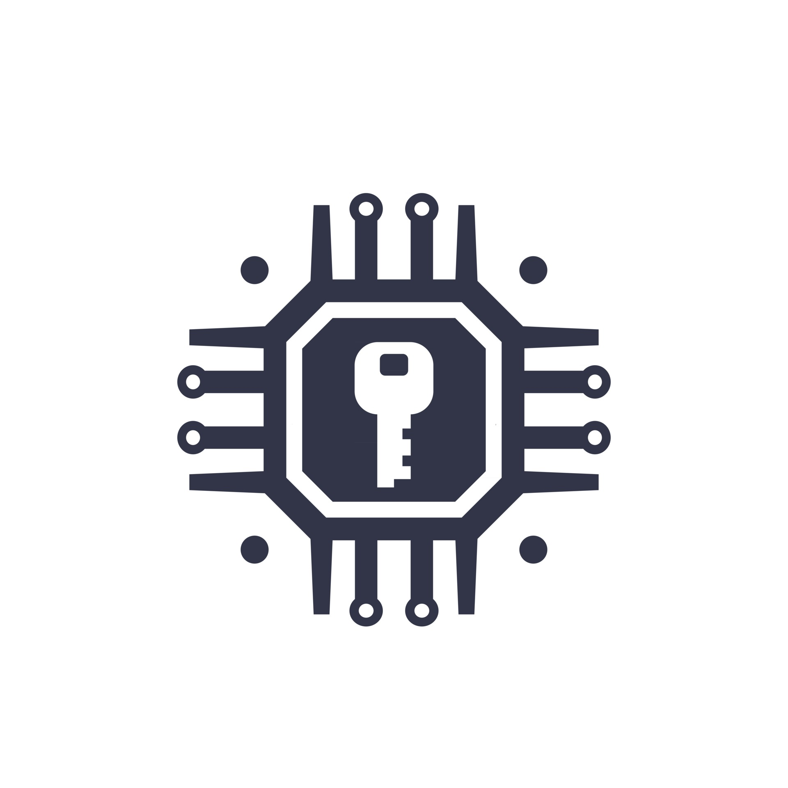
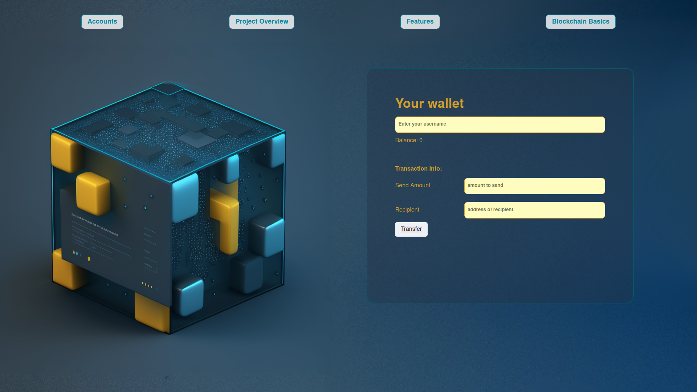

[![LinkedIn][linkedin-shield]][linkedin-url]

<!-- PROJECT LOGO -->
 

  
  </a>
  <h3 align="center">
    <a href="https://github.com/julienbrs/minimal-blockchain">Centralized Minimal Blockchain</a>
  </h3>
  

<!-- TABLE OF CONTENTS -->

## Table of Contents

- [About the Project](#about-the-project)
  - [Features](#features)
  - [Limitations](#limitations)
- [Getting Started](#getting-started)
  - [Client](#client)
  - [Server](#server)
- [Ressources](#ressources)
- [License](#license)
- [Contact](#contact)

## About the project

Simple blockchain project node using ECDSA technology that demonstrates the power of public key cryptography in securing transactions between local accounts. With this project, you can safely transfer funds locally from one account to another using digital signatures, which ensure that only the user with the appropriate private key can authorize a transaction.

    

## Features

- Public key cryptography: Transactions are secured using digital signatures that verify the identity of the sender.
- Private key ownership verification: Users must verify that they own the private key corresponding to the address that is sending funds.
- Centralized server: Transactions are processed by a single server, which ensures consistency and security.
- Local Wallet: Users can create a wallet and store their private key locally.
- Transaction history: Users can view their transaction history and balances: To be implemented

## Limitations

- Trust in server operator: Since the server is centralized, users must trust the operator not to act maliciously.
- Centralization: The centralized nature of the server may limit scalability and decentralization efforts.
- Simplified implementation: This project is intended as a learning exercise and does not include all the features or complexities of a real-world blockchain.

## How to get started

### Client

The client folder contains a [react app](https://reactjs.org/) using [vite](https://vitejs.dev/). To get started, follow these steps:

1. Open up a terminal in the `/client` folder
2. Run `npm install` to install all the depedencies
3. Run `npm run dev` to start the application
4. Now you should be able to visit the app at http://127.0.0.1:5173/

### Server

The server folder contains a node.js server using [express](https://expressjs.com/). To run the server, follow these steps:

1. Open a terminal within the `/server` folder
2. Run `npm install` to install all the depedencies
3. Run `node index` to start the server

The application should connect to the default server port (3042) automatically!

- Use [nodemon](https://www.npmjs.com/package/nodemon) instead of `node` to automatically restart the server on any changes.

## Ressources

- [Blockchain Basics](https://www.investopedia.com/terms/b/blockchain.asp): An introduction to blockchain technology
- [Bitcoin Whitepaper](https://bitcoin.org/bitcoin.pdf): The original Bitcoin whitepaper by Satoshi Nakamoto
- [Ethereum Whitepaper](https://ethereum.org/en/whitepaper/): The Ethereum whitepaper by Vitalik Buterin
- [Elliptic Curve Digital Signature Algorithm (ECDSA)](https://en.wikipedia.org/wiki/Elliptic_Curve_Digital_Signature_Algorithm): An explanation of ECDSA on Wikipedia
- [Secp256k1](https://en.bitcoin.it/wiki/Secp256k1): The elliptic curve used by Bitcoin and other cryptocurrencies

## License

This project is licensed under the MIT License

## Contact

Bourseau Julien - _2nd year student at Ensimag, 2022_ - [Linkedin](https://www.linkedin.com/in/julien-bourseau-ba2239228)

Project Link: [Minimal-blockchain](https://github.com/julienbrs/minimal-blockchain)

[linkedin-shield]: https://img.shields.io/badge/-LinkedIn-black.svg?style=for-the-badge&logo=linkedin&colorB=555
[linkedin-url]: https://www.linkedin.com/in/julien-bourseau-ba2239228
